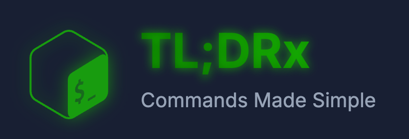

<div align="center">



### Commands Made Simple 🚀

**An intelligent, lightning-fast Unix/Linux command reference Progressive Web App**

[](https://react.dev/)
[](https://vitejs.dev/)
[](https://tailwindcss.com/)
[](https://web.dev/progressive-web-apps/)

[](./LICENSE)
[](https://nodejs.org/)
[](https://web.dev/inp/)
[](https://tldrx.vladbortnik.dev)

[🌐 Live Demo](https://tldrx.vladbortnik.dev) • [🐛 Report Bug](https://github.com/vladbortnik/TLDRx/issues) • [💡 Request Feature](https://github.com/vladbortnik/TLDRx/issues)

</div>

---

## 📋 Table of Contents

- [✨ Overview](#-overview)
- [🎯 Key Features](#-key-features)
- [🚀 Quick Start](#-quick-start)
- [💻 Usage Guide](#-usage-guide)
- [⚡ Performance](#-performance)
- [🛠️ Tech Stack](#️-tech-stack)
- [📁 Project Structure](#-project-structure)
- [🤝 Contributing](#-contributing)
- [📄 License](#-license)
- [🙏 Acknowledgments](#-acknowledgments)

---

## ✨ Overview

**TL;DRx** is a next-generation Progressive Web App that transforms how developers interact with Unix/Linux command documentation. Built with React 19 and optimized for 2025's web standards, it delivers instant command lookup with **sub-50ms response times** and an intuitive, Matrix-inspired interface.

### 🎯 Why TL;DRx?

- **📱 Install Anywhere** - Works offline as a PWA on desktop and mobile
- **⚡ Blazing Fast** - 93.4% performance improvement with virtual scrolling
- **🔍 Smart Search** - 4-tier fuzzy search with consecutive match bonuses
- **🎨 Beautiful UI** - Matrix terminal theme with GPU-accelerated animations
- **📱 Fully Responsive** - Optimized layouts for all screen sizes from mobile to desktop
- **🆓 Free & Open Source** - MIT licensed, community-driven

### 🌟 Live Demo

**Experience it now:** [https://tldrx.vladbortnik.dev](https://tldrx.vladbortnik.dev)

Try searching for commands like `grep`, `docker`, `ssh`, or `git` to see instant, intelligent results.

---

## 🎯 Key Features

### 🔥 Core Functionality

| Feature | Description |
|---------|-------------|
| **500+ Commands** | Comprehensive library covering System, Security, Shell, File Operations, Text Processing, Networking, Development, and more |
| **Intelligent Fuzzy Search** | 4-tier priority system ranks results by relevance with exact matches prioritized |
| **Platform Filtering** | Multi-select filters for Linux, macOS, and Windows with OR logic |
| **11 Categories** | Organized taxonomy for easy navigation and discovery |
| **Virtual Scrolling** | React Virtuoso renders only visible cards for optimal performance |
| **Offline Support** | Service worker caching enables full offline functionality |

### 🎨 User Experience

- **Matrix Terminal Theme** - Dark UI with signature green accent glows
- **Fully Responsive Design** - Fluid layouts adapt seamlessly across smartphones, tablets, and desktop displays
- **Scroll-Based Transitions** - Seamless switch between full and mini search interfaces
- **One-Click Copy** - Copy command examples instantly with visual feedback
- **Related Commands** - Discover similar, alternative, and complementary commands
- **Collapsible Sections** - Expandable key features, warnings, and advanced options
- **Man Page Integration** - Direct links to official documentation
- **PWA Installation** - Add to home screen, works like a native app

### ⚡ Performance Optimizations

```
📊 Core Web Vitals (2025 Standards)
┌─────────────────────────────────────────┐
│ INP:        47ms    (Target: <200ms) ✅ │
│ Search:     150ms   (Debounced)      ✅ │
│ Rendering:  ~15     (Virtual cards)  ✅ │
│ Bundle:     Optimized with Vite 7    ✅ │
└─────────────────────────────────────────┘
```

- **React.memo** - Component memoization prevents unnecessary re-renders
- **useMemo** - Multi-stage filter pipeline optimization
- **IntersectionObserver** - Efficient scroll detection without event listeners
- **RequestAnimationFrame** - Throttled scroll handlers
- **150ms Debouncing** - Instant-feeling search with optimized re-renders
- **GPU Acceleration** - Smooth CSS transitions and wave animations

---

## 🚀 Quick Start

### Prerequisites

- **Node.js** 18.0 or higher
- **npm**, **yarn**, or **pnpm**

### Installation

```bash
# Clone the repository
git clone https://github.com/vladbortnik/TLDRx.git
cd TLDRx

# Install dependencies
npm install

# Start development server
npm run dev
```

The app will be available at **http://localhost:5173**

### Available Scripts

| Command | Description |
|---------|-------------|
| `npm run dev` | Start development server with hot reload |
| `npm run build` | Build optimized production bundle |
| `npm run preview` | Preview production build locally |
| `npm run lint` | Run ESLint for code quality checks |
| `npm run test` | Run Vitest unit tests |
| `npm run test:watch` | Run tests in watch mode |

### Building for Production

```bash
# Create optimized production build
npm run build

# Preview the production build
npm run preview
```

Build output will be in the `dist/` directory, ready for deployment.

---

## 💻 Usage Guide

### 🔍 Basic Search

1. **Type** any command name (e.g., `grep`, `docker`, `ssh`) in the search bar
2. **Fuzzy search** automatically finds matches as you type
3. **Results** are ranked by relevance with exact matches at the top

### 🎛️ Filtering

- **Platform Filters**: Click Linux, macOS, or Windows badges to filter by platform
- **Category Filters**: Click "Advanced filters" to select from 11 categories
- **Combine Filters**: Use multiple filters simultaneously for precise results
- **Clear Filters**: Click the logo to reset all filters and return to top

### 📇 Command Cards

Each command card displays comprehensive information:

```
┌─────────────────────────────────────────┐
│ 🟢 grep                                 │
│ "Globally search for Regular            │
│  Expression and Print"                  │
├─────────────────────────────────────────┤
│ Syntax: grep [options] pattern [files]  │
├─────────────────────────────────────────┤
│ 📌 Key Features                         │
│ 💻 Code Examples (click to copy)        │
│ ⚠️  Warnings                            │
│ 🔗 Related Commands                     │
│ 📖 Man Page Link                        │
└─────────────────────────────────────────┘
```

### ⌨️ Keyboard & Interaction

- **Click search area** to focus input
- **Scroll down** to activate mini search mode (compact header)
- **Click logo** to reset all filters and scroll to top
- **Click examples** to copy to clipboard with visual feedback

---

## ⚡ Performance

### 📈 Metrics Overview

| Metric | Before | After | Improvement |
|--------|--------|-------|-------------|
| **INP** | 710ms | 47ms | 93.4% ⬇️ |
| **Cards Rendered** | 500 | ~15 | 97% ⬇️ |
| **Memory Usage** | High | Low | Optimized |
| **Search Response** | Variable | <150ms | Consistent |

### 🎯 2025 Web Standards Compliance

TL;DRx exceeds all Core Web Vitals targets:

- ✅ **Interaction to Next Paint (INP)**: 47ms (Target: <200ms)
- ✅ **First Contentful Paint (FCP)**: <1.8s
- ✅ **Largest Contentful Paint (LCP)**: <2.5s
- ✅ **Cumulative Layout Shift (CLS)**: <0.1

### 🚀 Virtual Scrolling Impact

```
Traditional Rendering          Virtual Rendering
┌─────────────────┐           ┌─────────────────┐
│ Card 1          │           │ Card 1          │
│ Card 2          │           │ Card 2          │
│ ...             │           │ ...             │
│ Card 500        │ 710ms     │ Card 15         │ 47ms
│ (All in DOM)    │   →       │ (Visible only)  │
└─────────────────┘           └─────────────────┘
```

---

## 🛠️ Tech Stack

### 🎯 Core Framework

| Technology | Version | Purpose |
|------------|---------|---------|
| **React** | 19.1 | UI library with Compiler optimizations |
| **Vite** | 7.1 | Lightning-fast build tool and dev server |
| **Tailwind CSS** | 3.4 | Utility-first CSS framework |

### 📦 Key Libraries

- **React Virtuoso 4.14** - Virtual scrolling for 500+ commands
- **Radix UI** - Accessible component primitives (Accordion, Dialog, Tooltip)
- **Lucide React 0.542** - Beautiful, consistent icon set
- **React Icons 5.5** - Comprehensive icon library
- **class-variance-authority** - Type-safe CSS class composition
- **clsx & tailwind-merge** - Efficient class name merging

### 🔧 Development Tools

- **ESLint 9.29** - Code linting and quality enforcement
- **Vitest 3.2** - Fast unit testing framework
- **Playwright 1.53** - End-to-end testing
- **Puppeteer 24.19** - Browser automation for testing
- **@testing-library/react 16.3** - React component testing utilities

### 🌐 PWA Stack

- **Vite PWA Plugin 1.0** - Progressive Web App generation
- **Workbox 7.3** - Service worker and caching strategies
- **Web Manifest** - App metadata and icon configuration

### 🎨 Design System

- **CSS Variables** - Dynamic theming
- **CSS Transforms** - GPU-accelerated animations
- **IntersectionObserver** - Efficient visibility detection
- **RequestAnimationFrame** - Smooth scroll handling

---

## 📁 Project Structure

```
TL;DRx/
├── public/                          # Static assets
│   ├── icons/                       # PWA icons and app images
│   │   ├── icon-192x192.png
│   │   ├── icon-512x512.png
│   │   └── tldr.png                 # Banner image
│   └── favicon.svg
│
├── src/
│   ├── main.jsx                     # React app initialization
│   ├── App.jsx                      # Main orchestrator (593 lines)
│   │
│   ├── components/
│   │   ├── commands/                # Command display components
│   │   │   ├── CommandGrid.jsx     # Virtual scrolling container
│   │   │   ├── CommandCard.jsx     # Individual command card (memoized)
│   │   │   └── CommandCardHeader.jsx # Card header (memoized)
│   │   │
│   │   ├── filters/                 # Filtering components
│   │   │   ├── FilterBar.jsx       # Main filter container
│   │   │   ├── PlatformFilterButton.jsx
│   │   │   └── CategoryFilters.jsx # Advanced category filters
│   │   │
│   │   ├── search/                  # Search interface
│   │   │   ├── SearchInterface.jsx # Full search header
│   │   │   ├── SearchInput.jsx     # Search input field
│   │   │   ├── SearchInterfaceMini.jsx # Compact search header
│   │   │   └── ResultsCounter.jsx  # Results count display
│   │   │
│   │   ├── ui/                      # Reusable UI components
│   │   │   ├── LoadingState.jsx
│   │   │   ├── ErrorState.jsx
│   │   │   ├── badge.jsx
│   │   │   ├── button.jsx
│   │   │   ├── input.jsx
│   │   │   └── utils.js
│   │   │
│   │   ├── Header.jsx               # App header
│   │   └── PWAInstall.jsx           # PWA installation prompt
│   │
│   ├── data/
│   │   ├── commands.js              # 500+ commands (production)
│   │   ├── dev-loader.js            # Development data optimizer (development only)
│   │   └── chunks/                  # Command category modules (development only)
│   │       ├── index.js
│   │       ├── system.js
│   │       ├── security.js
│   │       ├── shell.js
│   │       ├── file-operations.js
│   │       ├── text-processing.js
│   │       ├── networking.js
│   │       ├── automation.js
│   │       ├── data-processing.js
│   │       ├── package-management.js
│   │       ├── development-*.js     # Git, Web, Containers, Database, etc.
│   │       └── ...
│   │
│   ├── hooks/
│   │   ├── useWaveAnimation.js      # Synchronized RGB wave animations
│   │   └── useScrollBehavior.js     # Header hide/show logic
│   │
│   ├── utils/
│   │   ├── ui-icons.js              # Platform/category icon configuration
│   │   └── copyToClipboard.js       # Clipboard utilities with feedback
│   │
│   └── __tests__/                   # Test suites
│       ├── App.test.jsx
│       ├── App.performance.test.jsx
│       ├── commands.test.js
│       └── setupTests.js
│
├── vite.config.js                   # Vite configuration
├── tailwind.config.js               # Tailwind CSS configuration
├── postcss.config.js                # PostCSS configuration
├── eslint.config.js                 # ESLint configuration
├── package.json                     # Dependencies and scripts
├── README.md                        # This file
└── LICENSE                          # MIT License
```

---

## 🤝 Contributing

Contributions are welcome and appreciated! TL;DRx is a community-driven project that benefits from diverse perspectives and expertise.

### 🐛 Reporting Issues

When reporting issues, please:

- Use the [GitHub issue tracker](https://github.com/vladbortnik/TLDRx/issues)
- Provide clear, detailed reproduction steps
- Include browser and OS information
- Attach screenshots or screen recordings if relevant
- Label the issue appropriately (bug, enhancement, question)

### 💡 Pull Requests

1. **Fork** the repository
2. **Create** a feature branch
   ```bash
   git checkout -b feature/amazing-feature
   ```
3. **Make** your changes following the existing code style
4. **Test** thoroughly
   ```bash
   npm run test
   npm run lint
   ```
5. **Commit** your changes with a descriptive message
   ```bash
   git commit -m 'feat: Add amazing feature'
   ```
6. **Push** to your branch
   ```bash
   git push origin feature/amazing-feature
   ```
7. **Open** a Pull Request with a clear description

### 📝 Development Guidelines

- Use **React.memo** for expensive components
- Implement proper error handling and loading states
- Write tests for new features (target >80% coverage)
- Update documentation as needed
- Follow conventional commit messages
- Ensure all tests pass before submitting PRs

### 🎨 Code Style

- Use **ES6+** syntax
- Follow **React Hooks** best practices
- Use **Tailwind CSS** utility classes
- Keep components **small and focused**
- Document complex logic with comments
- Use **TypeScript** JSDoc for type hints (optional)

---

## 📄 License

This project is licensed under the **MIT License** - see the [LICENSE](./LICENSE) file for full details.

### Summary

```
MIT License

Copyright (c) 2025 TL;DRx Development Team

Permission is hereby granted, free of charge, to any person obtaining a copy
of this software and associated documentation files (the "Software"), to deal
in the Software without restriction, including without limitation the rights
to use, copy, modify, merge, publish, distribute, sublicense, and/or sell
copies of the Software, and to permit persons to whom the Software is
furnished to do so, subject to the following conditions:

The above copyright notice and this permission notice shall be included in all
copies or substantial portions of the Software.

THE SOFTWARE IS PROVIDED "AS IS", WITHOUT WARRANTY OF ANY KIND, EXPRESS OR
IMPLIED, INCLUDING BUT NOT LIMITED TO THE WARRANTIES OF MERCHANTABILITY,
FITNESS FOR A PARTICULAR PURPOSE AND NONINFRINGEMENT.
```

---

## 🙏 Acknowledgments

### 🌟 Inspiration

- **[tldr-pages](https://github.com/tldr-pages/tldr)** - The original community-driven documentation project
- **[DevDocs](https://devdocs.io/)** - Fast, offline API documentation browser
- **Modern Terminal UIs** - Inspiration from tools like Warp, Hyper, and Starship

### 📚 Resources

- **Command Data** - Curated from official documentation, man pages, and community resources
- **Icons** - React Icons, Lucide React, and custom Matrix-themed designs
- **Performance Research** - Google Web.dev guidelines and Core Web Vitals

### 🛠️ Technologies

Special thanks to the maintainers and contributors of:

- React team for React 19 and Compiler optimizations
- Vite team for the blazing-fast build tool
- Tailwind Labs for the utility-first CSS framework
- Radix UI for accessible component primitives
- React Virtuoso for the virtual scrolling implementation

### 🌐 Community

Thank you to all contributors who have helped shape TL;DRx:

- [Contributors](https://github.com/vladbortnik/TLDRx/graphs/contributors)
- [Issue reporters](https://github.com/vladbortnik/TLDRx/issues)
- [Feature suggesters](https://github.com/vladbortnik/TLDRx/issues?q=label%3Aenhancement)

---

## 📞 Contact & Support

<div align="center">

### 🌐 Links

[🚀 Live Demo](https://tldrx.vladbortnik.dev) • [🐛 Report Bug](https://github.com/vladbortnik/TLDRx/issues) • [💡 Request Feature](https://github.com/vladbortnik/TLDRx/issues)

### 💬 Stay Connected

[](https://github.com/vladbortnik)
[](https://twitter.com/yourusername)
[](https://www.linkedin.com/in/vladbortnik)

</div>

---

<div align="center">

### 🌟 Star History

[](https://star-history.com/#vladbortnik/TLDRx&Date)

---

**Built with ❤️ by the TL;DRx Development Team**

*Making command-line mastery accessible to everyone.*

**2025 | Optimized for the Modern Web**

</div>
